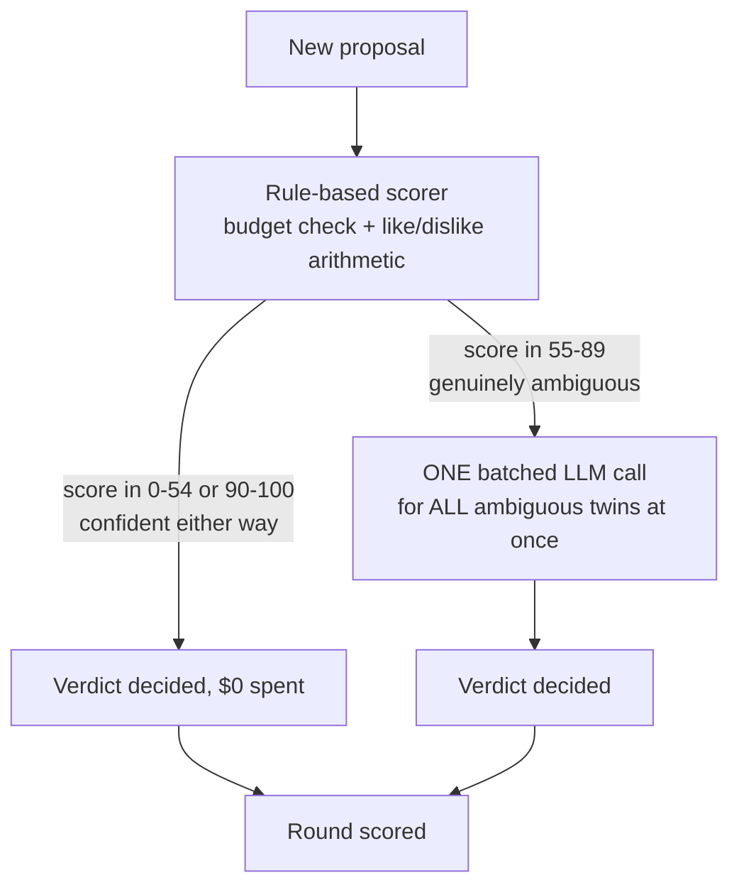
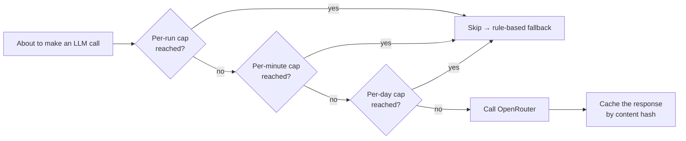
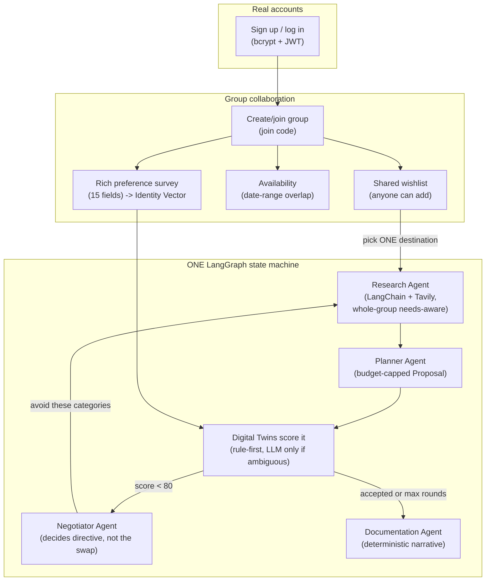

# Design Rationale — The Thinking Behind the Multi-Agent System

This document exists because "why did you build it this way" is a different
question from "what did you build" (that's [`SYSTEM_ARCHITECTURE.md`](SYSTEM_ARCHITECTURE.md)).
Every section below is a decision that had a real alternative, and why the
alternative lost.

## 1. One LangGraph pipeline, not two frameworks (revised)

An earlier version of this system used CrewAI for web research (three
specialist agents + a synthesizer) alongside a separate LangGraph state
machine for negotiation — reasoned, at the time, as "different shaped
problems deserve different tools." That trade-off was real, but so was its
cost: two agent frameworks meant two mental models, two dependency trees, and
research living *outside* the negotiation loop instead of inside it.

The system was consolidated into **one LangGraph StateGraph** with Research,
Planner, Twins, and Negotiator as explicit nodes (see the diagram in
[`SYSTEM_ARCHITECTURE.md`](SYSTEM_ARCHITECTURE.md)). Research is now a
LangChain tool-calling step (a `ChatOpenAI`-compatible model pointed at
OpenRouter, given a Tavily search tool) that runs as a graph node like
everything else — not a separate crew handed off to and back from. The
practical win: when the Negotiator decides a category needs to change, it
routes straight back to the *same* Research node with a fresh directive,
inside the *same* state machine, instead of crossing a framework boundary to
re-invoke a different system. One state machine, one place to reason about
the whole pipeline's behavior.

## 2. Why the Digital Twins don't call an LLM for every proposal

The single most common mistake in multi-agent tutorials: an agent calls the LLM
to decide *everything*, including things a five-line `if` statement could
decide for free. Concretely, here's the decision tree every proposal goes
through:

Two numbers make this concrete: in the reasoner's own test suite
(`backend/tests/test_reasoner.py`), scoring is a pure function of budget fit +
category overlap — cheap, deterministic, and it agrees with what an LLM would
say for the *obvious* cases (over budget = reject, matches every like = accept).
The LLM only earns its cost in the narrow band where the rule genuinely can't
tell — and even then, one call scores every ambiguous twin in the group at
once, not one call per twin.

## 3. Guardrails are layered, not singular

"Don't run up a huge bill" isn't one check — it's three, each catching a
different failure mode:

- **Per-run** (`MAX_LLM_CALLS_PER_RUN`, in-process, resets each negotiation) —
  catches a single runaway negotiation.
- **Per-minute / per-day** (`budget_guard.py`, persisted in SQLite/Postgres,
  survives restarts) — catches sustained abuse or a bug that keeps triggering
  new runs.
- **Content-hash cache** — the same proposal + identity-vector-version + model
  never gets re-priced twice, so even legitimate repeated use doesn't
  re-spend.

A **separate**, unrelated guardrail protects the *traveler's* budget, not the
LLM bill: `mediator.build_initial_proposal()` greedily selects points of
interest that fit under the group's tightest `budget_max` — it doesn't
propose four expensive items and let the rule-based scorer reject them after
the fact. Proposing something "way above budget" and then discovering that is
wasted work; not proposing it at all is the actual fix (see
`test_build_initial_proposal_never_exceeds_the_tightest_budget`).

## 4. The Negotiator decides *what*, not *which* — it doesn't do Research's job

An early draft had the Negotiator directly pick a replacement POI itself
(query GraphRAG, choose an alternative, done). That collapses two different
questions into one function: "what's wrong with this proposal" and "what
should replace it" are genuinely separate judgments — the first is about
*this specific group's* rejections, the second is a search-and-select problem
that deserves the same budget-aware, needs-aware treatment the *first*
proposal got. So `negotiator_directive()` only computes the former (which
categories are causing rejections) and hands it back to Research as a
directive ("avoid these categories") — Research and Planner then do the real
work of finding and selecting a genuine alternative, the same way they did for
round 1. This is the same principle as guardrail #3 above, applied to
*quality* instead of *cost*: don't let one node shortcut another's job just
because it's convenient in the moment.

The standalone destination-insights feature (`research_agent.py::
research_insights`, `POST /api/research/{id}`) uses a related but separate
idea: one search call, one LLM synthesis call that's given an explicit budget
ceiling and told to flag — not silently ignore — a price trend that exceeds
it. Same "evaluate, don't just relay" principle, simpler because it's a
single destination-level lookup, not a group negotiation.

## 5. The Documentation Agent is deterministic, deliberately

It would be easy to add a fifth LLM call that "writes up what happened."
`documentation_agent.py` doesn't do that — every fact it narrates (who
rejected what, why, what got swapped in) was already captured for free during
scoring. Spending an LLM call to reformat data you already have in structured
form is the exact anti-pattern this whole design pushes against. If a more
literary narrative is ever wanted, that's a legitimate *future* one-call
addition — but it should be an explicit choice, not the default.

## 6. Why Reddit, not Instagram

Instagram has no public API for pulling third-party posts by location or
hashtag. The only paths in are either an official Business API (scoped to
posts *you* own, useless for "what's trending in Lisbon") or scraping, which
breaks Instagram's Terms of Service, is fragile against layout changes, and
risks the deploying IP getting blocked. Reddit's public search API is free,
documented, and legitimate — city and travel subreddits are a genuinely good
proxy for "what's currently worth seeing," without the legal and reliability
problems.

## 7. Why the negotiation plans *within* one destination, not between cities

Early versions had the mediator propose entire cities as the negotiable unit
("Paris vs. Rio vs. Tokyo"). That's not what a group actually disagrees about
once they've picked a destination — they disagree about the Louvre vs. the
Eiffel Tower vs. a day trip to Versailles. `build_initial_proposal()` takes a
single `destination_id` (chosen from the group's shared wishlist) and
negotiates the *points of interest inside it*, sourced from GraphRAG +
Reddit trending, filtered by the group's collective likes/dislikes. This also
made the budget guardrail (#3) meaningfully tighter to reason about: "does
this set of POIs fit the budget" is a much better-scoped question than "does
this entire trip to a different continent fit the budget."

## 8. Why real accounts changed the storage layer

The original prototype used JSON files keyed by a typed-in name — fine for a
solo demo, not fine for "let others add to the wishlist," which only means
something if "others" are real, distinguishable people. That's what forced
the move to SQLAlchemy + real tables (`app/db/models.py`): a shared wishlist,
a survey that can't be submitted as someone else, and a join code that
actually gates group membership all require an authenticated `user_id` behind
every write. The dual SQLite/Postgres design (`app/db/engine.py`) exists
because serverless (Vercel) has no persistent local disk — a JSON file or
SQLite file wouldn't survive between invocations there, but would work fine
in Docker. One codebase, one `DATABASE_URL` switch, not two implementations.

## 9. Why the survey grew from 5 fields to 15

The original survey asked for budget, pace, likes, dislikes, and free-text
notes — enough to prove the negotiation loop worked, not enough to actually
personalize a trip. "Ask as many questions as you can" isn't about UI
completeness for its own sake; each field added earns its place by being
something Research, Planner, or the rule-based scorer can *act on*:
`accommodation_style` and `food_preferences` feed Research's search query and
the eventual itinerary's lodging/dining choices; `must_see`/`avoid` are
specific enough that no category-level like/dislike would catch them;
`trip_priority` aggregates across the whole group into Research's directive
(see `aggregate_needs()`); `chronotype`/`transportation_pref` matter for
scheduling even though nothing consumes them yet (flagged in §10). The
deliberate choice was a **structured form**, not a conversational LLM
interview — every field here is answered in one pass, for free, with no LLM
call required to extract structure from prose. A chat-style interview agent
that asks adaptive follow-ups is a legitimate richer version of this, at the
cost of an LLM call per follow-up per member; this repo takes the free path
first, same as every other design choice here.

## 10. The whole system, end to end

## 11. What this doesn't solve (yet)

- `chronotype` and `transportation_pref` are captured in the Identity Vector
  and handed to Research as context, but nothing yet *schedules* around them
  (e.g. sequencing POIs so an early-bird twin's day starts earlier) — they're
  informational context today, not an active scheduling constraint.
- The Documentation Agent narrates a single negotiation run; it doesn't yet
  aggregate a full trip's history (survey → negotiation → end survey) into one
  retrospective document.
- Real Amadeus flight pricing isn't wired into the negotiation's cost
  calculation yet — POI costs come from Research (real web estimates when
  configured, the curated seed dataset otherwise).
- The rich survey is a structured form, not a conversational interview agent
  (see §9) — a legitimate richer version, deliberately not built first.

None of these are hard, they're just not built — flagged here instead of
silently glossed over, same policy as the rest of this project's documentation.
