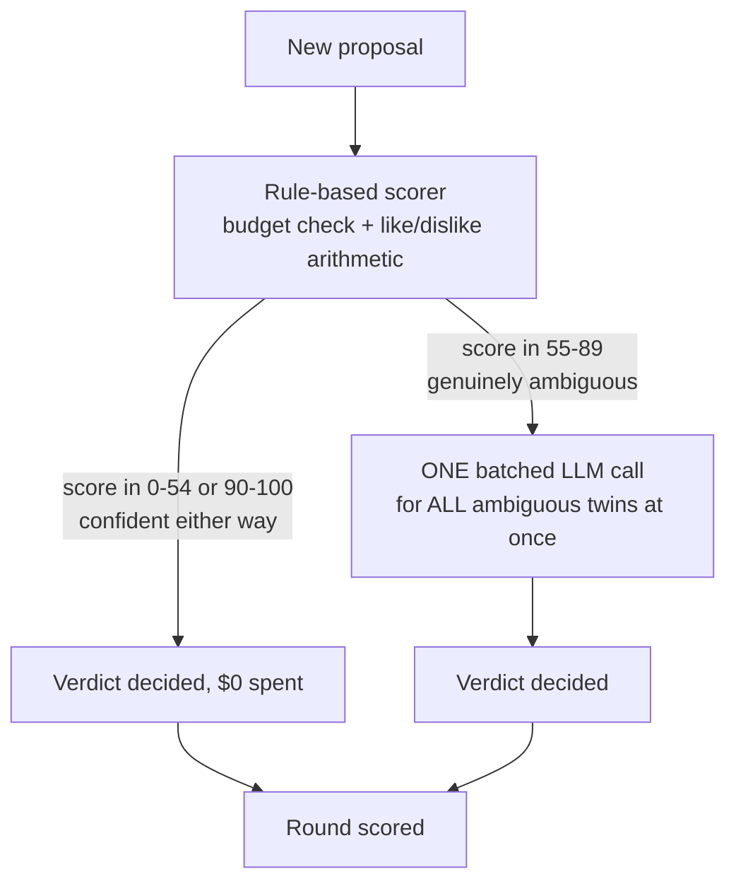
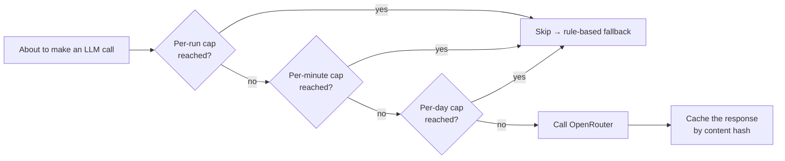
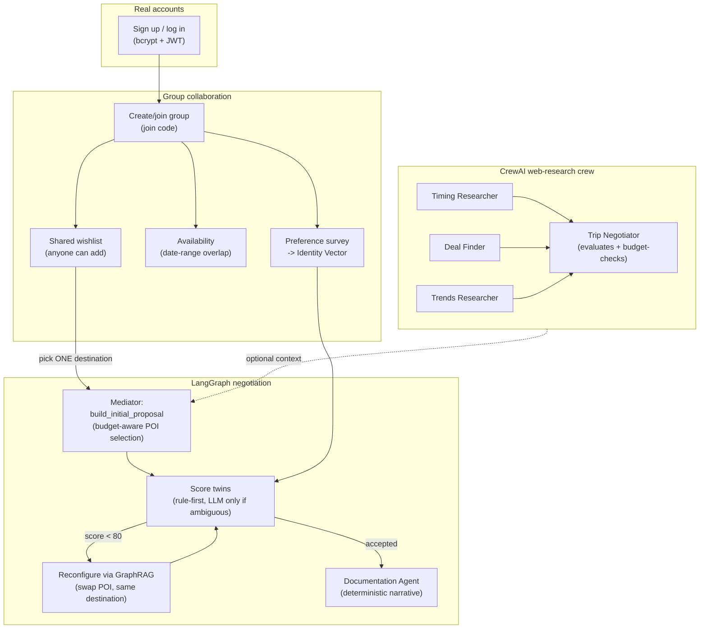

# Design Rationale — The Thinking Behind the Multi-Agent System

This document exists because "why did you build it this way" is a different
question from "what did you build" (that's [`SYSTEM_ARCHITECTURE.md`](SYSTEM_ARCHITECTURE.md)).
Every section below is a decision that had a real alternative, and why the
alternative lost.

## 1. Two agent frameworks, on purpose, not by accident

The system uses **both** LangGraph and CrewAI — not because more frameworks is
better, but because they solve different shaped problems:

| Problem | Framework | Why |
|---|---|---|
| Negotiation: propose → score → reconfigure → repeat | **LangGraph** | This is a *state machine* with an explicit loop and a clear exit condition (score ≥ 80 or everyone accepts). LangGraph's graph-of-nodes model maps onto that directly — `score` and `reconfigure` are nodes, the loop-back edge is the state machine's actual shape. |
| Web research: three independent lines of inquiry that get synthesized | **CrewAI** | This is a *crew* of specialists working in parallel-ish sequence toward one deliverable. CrewAI's Agent/Task/Crew model is built exactly for "several roles research their slice, then someone synthesizes" — forcing that into a hand-rolled state graph would just be reimplementing CrewAI badly. |

Using one framework for both would mean bending one of these problems into the
wrong shape. That's a bigger cost than learning two APIs.

## 2. Why the Digital Twins don't call an LLM for every proposal

The single most common mistake in multi-agent tutorials: an agent calls the LLM
to decide *everything*, including things a five-line `if` statement could
decide for free. Concretely, here's the decision tree every proposal goes
through:

Two numbers make this concrete: in the reasoner's own test suite
(`backend/tests/test_reasoner.py`), scoring is a pure function of budget fit +
category overlap — cheap, deterministic, and it agrees with what an LLM would
say for the *obvious* cases (over budget = reject, matches every like = accept).
The LLM only earns its cost in the narrow band where the rule genuinely can't
tell — and even then, one call scores every ambiguous twin in the group at
once, not one call per twin.

## 3. Guardrails are layered, not singular

"Don't run up a huge bill" isn't one check — it's three, each catching a
different failure mode:

- **Per-run** (`MAX_LLM_CALLS_PER_RUN`, in-process, resets each negotiation) —
  catches a single runaway negotiation.
- **Per-minute / per-day** (`budget_guard.py`, persisted in SQLite/Postgres,
  survives restarts) — catches sustained abuse or a bug that keeps triggering
  new runs.
- **Content-hash cache** — the same proposal + identity-vector-version + model
  never gets re-priced twice, so even legitimate repeated use doesn't
  re-spend.

A **separate**, unrelated guardrail protects the *traveler's* budget, not the
LLM bill: `mediator.build_initial_proposal()` greedily selects points of
interest that fit under the group's tightest `budget_max` — it doesn't
propose four expensive items and let the rule-based scorer reject them after
the fact. Proposing something "way above budget" and then discovering that is
wasted work; not proposing it at all is the actual fix (see
`test_build_initial_proposal_never_exceeds_the_tightest_budget`).

## 4. Why the "negotiator" evaluates instead of just relaying

The research crew's first draft had three researchers (timing, price, trends)
whose raw output was concatenated and shown as-is. That's not really a
*decision* — it's three opinions with no judgment applied. The fix was adding
a fourth agent, the **Trip Negotiator**, whose only job is to read the other
three agents' findings (via CrewAI's `context=` task chaining — no extra
search, no extra research) and decide what's actually worth recommending,
explicitly weighed against the group's budget ceiling. This is the same
principle as guardrail #3 above, applied to *quality* instead of *cost*: don't
just relay what an agent found, evaluate whether it's actually good advice.

## 5. The Documentation Agent is deterministic, deliberately

It would be easy to add a fifth LLM call that "writes up what happened."
`documentation_agent.py` doesn't do that — every fact it narrates (who
rejected what, why, what got swapped in) was already captured for free during
scoring. Spending an LLM call to reformat data you already have in structured
form is the exact anti-pattern this whole design pushes against. If a more
literary narrative is ever wanted, that's a legitimate *future* one-call
addition — but it should be an explicit choice, not the default.

## 6. Why Reddit, not Instagram

Instagram has no public API for pulling third-party posts by location or
hashtag. The only paths in are either an official Business API (scoped to
posts *you* own, useless for "what's trending in Lisbon") or scraping, which
breaks Instagram's Terms of Service, is fragile against layout changes, and
risks the deploying IP getting blocked. Reddit's public search API is free,
documented, and legitimate — city and travel subreddits are a genuinely good
proxy for "what's currently worth seeing," without the legal and reliability
problems.

## 7. Why the negotiation plans *within* one destination, not between cities

Early versions had the mediator propose entire cities as the negotiable unit
("Paris vs. Rio vs. Tokyo"). That's not what a group actually disagrees about
once they've picked a destination — they disagree about the Louvre vs. the
Eiffel Tower vs. a day trip to Versailles. `build_initial_proposal()` takes a
single `destination_id` (chosen from the group's shared wishlist) and
negotiates the *points of interest inside it*, sourced from GraphRAG +
Reddit trending, filtered by the group's collective likes/dislikes. This also
made the budget guardrail (#3) meaningfully tighter to reason about: "does
this set of POIs fit the budget" is a much better-scoped question than "does
this entire trip to a different continent fit the budget."

## 8. Why real accounts changed the storage layer

The original prototype used JSON files keyed by a typed-in name — fine for a
solo demo, not fine for "let others add to the wishlist," which only means
something if "others" are real, distinguishable people. That's what forced
the move to SQLAlchemy + real tables (`app/db/models.py`): a shared wishlist,
a survey that can't be submitted as someone else, and a join code that
actually gates group membership all require an authenticated `user_id` behind
every write. The dual SQLite/Postgres design (`app/db/engine.py`) exists
because serverless (Vercel) has no persistent local disk — a JSON file or
SQLite file wouldn't survive between invocations there, but would work fine
in Docker. One codebase, one `DATABASE_URL` switch, not two implementations.

## 9. The whole system, end to end

## 10. What this doesn't solve (yet)

- The research crew's `max_budget` guardrail is advisory in its *prose*
  output — it doesn't yet feed back into `build_initial_proposal`'s numeric
  selection. A real integration would have the crew's price findings adjust
  `est_cost` estimates before the budget-aware greedy selection runs.
- The Documentation Agent narrates a single negotiation run; it doesn't yet
  aggregate a full trip's history (survey → negotiation → end survey) into one
  retrospective document.
- Real Amadeus flight pricing isn't wired into the negotiation's cost
  calculation yet — POI costs are still from the curated seed dataset.

None of these are hard, they're just not built — flagged here instead of
silently glossed over, same policy as the rest of this project's documentation.
