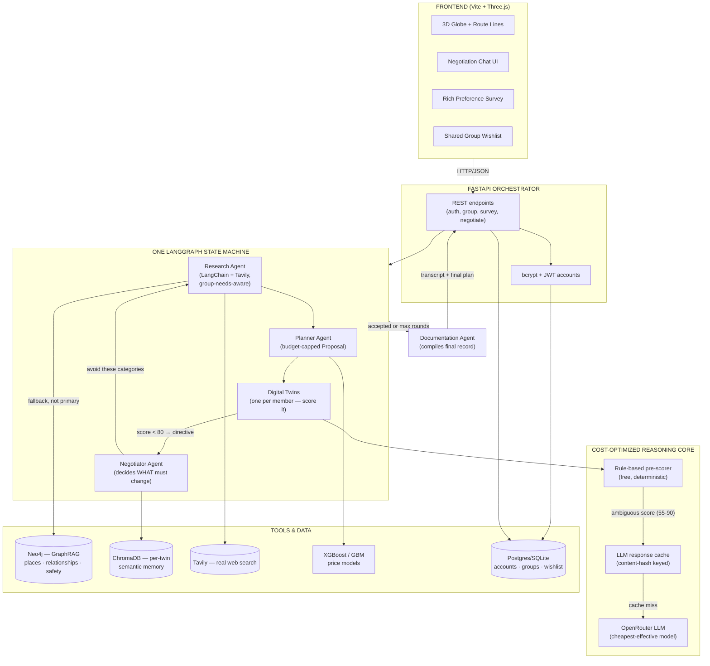

# System Architecture — Multi-Agent Group Trip Planner

This document describes the current architecture and, where a section says
**[BUILT]**, that piece is real and tested today. Everything else is designed but
not yet implemented — see [`IMPLEMENTATION_CHECKLIST.md`](IMPLEMENTATION_CHECKLIST.md)
for exact status. See [`DESIGN_RATIONALE.md`](DESIGN_RATIONALE.md) for *why* it's
built this way.

## The idea, restated precisely

A **group** (like a group chat) is created by an **admin** who sets a join code.
Anyone with the link + code (real accounts — bcrypt + JWT) joins and fills out a
**rich preference survey** (budget, likes/dislikes, food preferences, accommodation
style, must-see items, chronotype, transportation, trip priority, accessibility
needs...) — this becomes their **Identity Vector**. Each member gets a **Digital
Twin**: an agent that argues on their behalf during planning, using their Identity
Vector plus anything learned from past trips (vector memory).

The negotiation itself is **one LangGraph state machine** coordinating four
distinct agent roles — not a monolithic "mediator does everything," and not a
second framework bolted on the side:

- **Research** finds real points of interest for the destination, informed by the
  WHOLE group's aggregated needs (not just the destination name in isolation) —
  real web search via LangChain + Tavily when configured, falling back to a
  static seed dataset otherwise (see "hardcoded vs. real" below).
- **Planner** turns Research's findings into a concrete, budget-capped Proposal.
- **Twins** (one per member) score the Proposal.
- **Negotiator** decides *what* needs to change when the score is too low, and
  hands that directive back to Research — it doesn't pick the replacement
  itself, it tells Research/Planner what to avoid and lets them re-plan.
- **Documentation** compiles the finished negotiation into a clear record for
  the group once it ends.

If the blended score is **< 80** (or 2+ twins reject), the loop repeats
(Negotiator → Research → Planner → Twins) up to 5 rounds. When the trip is over,
an **end survey** captures what worked and what didn't, feeding back into each
twin's memory for next time.

## Diagram



## Why this design keeps API calls (and cost) low

This is the part most multi-agent tutorials get wrong — they call the LLM for
*everything*, including things a rule can decide for free. Four deliberate choices:

1. **Rule-based pre-scorer is the default path — [BUILT].** Each twin's Identity
   Vector has structured fields (budget range, category likes/dislikes, pace). A
   proposal is scored against these with plain arithmetic: budget-fit %, category
   overlap, dislike collisions. This produces a 0–100 score **with zero API calls**.
   Most proposals are either obviously good (≥90, rule-score is trustworthy) or
   obviously bad (≤40, reject without asking an LLM to confirm the obvious).

2. **The LLM is only invoked in the ambiguous zone.** Only when the rule-based score
   lands in `[55, 90)` — genuinely uncertain — or the natural-language reasoning text
   is needed for the chat log, do we call OpenRouter. This alone typically eliminates
   the majority of calls a naive "ask the LLM to score everything" design would make.

3. **One batched call per round, not one call per twin.** When the LLM *is* needed,
   the mediator sends a single prompt containing all twins' identity summaries and
   gets back a structured JSON array of verdicts — turning what would be N calls into
   1. Context (GraphRAG relationships, ChromaDB memory hits) is pre-fetched and
   injected directly into that one prompt, rather than letting the model make its own
   tool calls in a loop (the #1 cost blowup in naive LangGraph/CrewAI agents).

4. **Content-hash response caching — [BUILT].** Every LLM call is cached by
   `hash(proposal + identity_vector_version + model)`. Re-scoring an unchanged
   proposal, or re-planning a similar trip next year, can hit the cache and cost
   nothing. TTL-free by default (identity vectors are versioned, so a cache entry is
   naturally invalidated when a twin's preferences change).

5. **Cheapest-effective model, swappable per role.** Default is
   `google/gemini-2.5-flash-lite` via OpenRouter for both twin scoring (high volume)
   and mediator synthesis (low volume) — configurable independently via
   `TWIN_MODEL` / `MEDIATOR_MODEL` env vars if you later want a stronger model just
   for the mediator's final write-up.

## Scoring & reconfiguration logic — [BUILT]

```
base_score      = average(twin.personal_score for twin in twins)
reject_count    = count(twin.verdict == REJECT)
penalty         = 0.55 if reject_count >= 2 else 1.0     # "hurts the score" per spec
final_score     = base_score * penalty

if final_score < 80:
    mediator queries GraphRAG for alternatives addressing each REJECTing twin's
    stated dislikes, builds a counter-proposal, and the round repeats
    (max 5 rounds; loop also breaks early if every twin ACCEPTs)
```

See `backend/app/agents/reasoner.py::score_proposal` and
`backend/app/agents/mediator.py::run_negotiation`.

## Component reference

| Component | File(s) | Status |
|---|---|---|
| Identity Vector schema (rich survey) | `backend/app/models/agent_schemas.py`, `backend/app/db/models.py` | **[BUILT]** — DB-backed, real accounts |
| Rule-based scorer | `backend/app/agents/reasoner.py` | **[BUILT]** |
| OpenRouter client + cache | `backend/app/agents/llm_client.py`, `cache.py` | **[BUILT]** (no-op without a key) |
| Digital Twin | `backend/app/agents/twin.py` | **[BUILT]** |
| Research Agent | `backend/app/agents/research_agent.py` | **[BUILT]** — LangChain + Tavily, falls back to static seed |
| Planner Agent | `backend/app/agents/mediator.py::plan_proposal` | **[BUILT]** — budget-capped selection |
| Negotiator Agent | `backend/app/agents/mediator.py::negotiator_directive` | **[BUILT]** — decides directive, doesn't pick the swap itself |
| Documentation Agent | `backend/app/agents/documentation_agent.py` | **[BUILT]** — deterministic, no extra LLM call |
| Unified negotiation pipeline | `backend/app/agents/mediator.py::run_negotiation` | **[BUILT]** — one LangGraph StateGraph, all four roles as nodes |
| GraphRAG (Neo4j) | `backend/app/agents/graphrag.py` + `docker-compose.agents.yml` | **[BUILT]** client + ingestion; runs against real Neo4j; now Research's *fallback*, not primary source |
| Vector memory (ChromaDB) | `backend/app/agents/memory.py` | **[BUILT]** client with graceful degrade |
| Real accounts (bcrypt + JWT) | `backend/app/auth.py`, `routers/auth.py` | **[BUILT]** |
| Group / join-code | `backend/app/routers/group.py` | **[BUILT]** — Postgres/SQLite, real accounts |
| Shared group wishlist | `backend/app/routers/wishlist.py` | **[BUILT]** |
| Availability overlap | `backend/app/routers/availability.py`, `app/scheduling.py` | **[BUILT]** |
| Start/end survey | `backend/app/routers/survey.py` | **[BUILT]** — rich intake, 15 fields |
| Negotiation endpoint | `backend/app/routers/negotiate.py` | **[BUILT]** |
| Negotiation chat UI | `frontend/src/panels/negotiationPanel.js` | **[BUILT]** — sign-in gated, rich survey form, wishlist, availability |
| Web trending-signal agent | `backend/app/agents/scraper.py` | **[BUILT]** — Reddit public search (not Instagram; see checklist) |
| Hard spend guardrails | `backend/app/agents/budget_guard.py` | **[BUILT]** — per-minute/day/run caps, verified with a real key |
| Real Amadeus/ML retraining on Kaggle data | — | not built (needs dataset + real key) |

## Real vs. mock, the same philosophy as the rest of the app

Every external dependency degrades gracefully, exactly like flights/weather/places
already do:

| Dependency | Missing → | Present →|
|---|---|---|
| `OPENROUTER_API_KEY` | rule-based scoring only (fully functional, $0) | LLM tie-breaks ambiguous scores + writes chat-log prose |
| `TAVILY_API_KEY` + `OPENROUTER_API_KEY` | Research uses the static GraphRAG seed dataset | Research Agent does real web search, informed by the group's aggregated needs |
| Neo4j reachable | GraphRAG queries return a small built-in static relationship dict | real Cypher queries against ingested destination graph |
| ChromaDB reachable | memory lookups return `[]` (no past-trip context) | real semantic search over each twin's trip history |
| `DATABASE_URL` set | SQLite file (local/Docker) | Postgres (Vercel/hosted) |

This means the whole pipeline is **testable end-to-end today**, for free, before
you spend a cent on OpenRouter/Tavily or run a single Docker container — verified
live: a real negotiation with a real LLM call producing genuinely personalized
reasoning (`"This trip perfectly aligns with Alice's love for museums and
history..."`), sourced from her rich survey answers, not a template.
